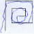
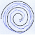
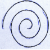
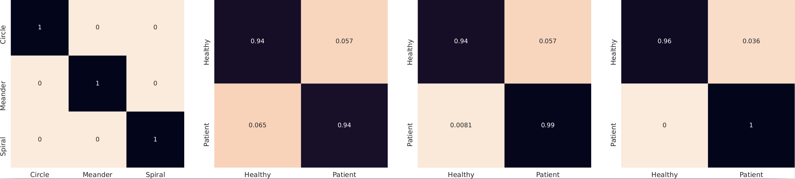

# Drawing-Aware PD detection

### Introduction

This repository contains an open-source toolbox for Parkinson's Disease (PD) detection from handwriting records based on PyTorch.

The main branch works with **PyTorch 1.8+**.

### What's New

* Release **Drawing-type classifier** ([code](https://github.com/IoannisKansizoglou/Drawing-Aware_PD_detection_through_hierarchical_DL_models/blob/main/codes/drawing-type%20classifier/train_model.py) and [weights](https://duth-my.sharepoint.com/:f:/g/personal/ikansizo_duth_gr/EohrhPpey5ZPhvJEhRi4wggBQRegu0VzsakZZ-SRll6MFA?e=uKOR5N)): a ResNet-18 model for classifying different drawing types (see drawing types below from the [NewHandPD](https://wwwp.fc.unesp.br/~papa/pub/datasets/Handpd/) database).

<table align="center">
  <tr>
    <td align="center">
      
       
       <em>(a) Circle</em> 
    </td>
    <td align="center">
      
       
       <em>(b) Meander</em> 
    </td>
    <td align="center">
      
       
       <em>(c) Spiral</em> 
    </td>
  </tr>
</table>
 

*  Release **Drawing-aware PD detectors** (code and [weights](https://duth-my.sharepoint.com/:f:/g/personal/ikansizo_duth_gr/Eh3UtjNP4iFLmj4XJRO98pwBgdp7XM96wyUJv9woAX4uXw?e=HV5hs9)): individual ResNet-18 models for PD detection from each drawing-type.

### Proposed Method

The proposed architecture is based on hierarchical DL models exploiting the well-established [ResNet-18 architecture](https://arxiv.org/pdf/1512.03385).
The input image after pre-processing ($\hat{I}$) is fed into the drawing recognition CNN model $\mathcal{F}_d$.
The classification result of the latter ($n$) is used to retrieve the respective stored weights $\theta_n$ for the cascaded CNN model $\mathcal{F}_n$, which, in turn, produces the outcome for PD detection from $\hat{I}$.

  

Overall, the main contributions of this work include:   

* the exploitation of a simpler yet more efficient CNN model, \textit{i.e.}, the ResNet-18 architecture~\cite{he2016deep}, benefiting detection performance compared against state-of-the-art methods;
* the adoption of a hierarchical PD detection scheme, which is divided into two distinctive tasks, \textit{i.e.}, recognition of the drawing test and, then, identification of the PD disease, leading to even more improved results;
* the exploitation of a strict $5$-fold cross-validation scheme on the well-established NewHandPD database~\cite{pereira2016deep} for a more accurate and transparent assessment of single HW image PD detection;
* an open-source code for the research community.

### Results on NewHandPD dataset

#### Confusion matrices

  

 

The proposed system is compared against state-of-the-art methods in the field of PD detection from handwriting images.

#### Comparative accuracy results (%) of the drawing-aware PD detection models against single-image classifiers in ensemble learning tasks 

<!-- Table 1 -->
<table align="center">
  <thead>
    <tr>
      <th>Reference</th>
      <th>Circle</th>
      <th>Meander</th>
      <th>Spiral</th>
    </tr>
  </thead>
  <tbody>
    <tr>
      <td>Zham <em>et al.</em> [1]</td>
      <td>-</td>
      <td>94.70</td>
      <td>92.70</td>
    </tr>
    <tr>
      <td>Agrawal <em>et al.</em> [2]</td>
      <td>85.48</td>
      <td>94.90</td>
      <td>96.10</td>
    </tr>
    <tr>
      <td>Bennour <em>et al.</em> [3]</td>
      <td>-</td>
      <td>96.43</td>
      <td>98.00</td>
    </tr>
    <tr>
      <td><strong>Ours</strong></td>
      <td><strong>93.68</strong></td>
      <td><strong>96.72</strong></td>
      <td><strong>97.98</strong></td>
    </tr>
  </tbody>
</table>
 

#### Comparative analysis of the proposed PD detection system against state-of-the-art single image PD detection models

<!-- Table 2 -->
<table align="center">
  <thead>
    <tr>
      <th>Reference</th>
      <th>Model</th>
      <th>Accuracy (%)</th>
      <th>Recall</th>
      <th>Precision</th>
    </tr>
  </thead>
  <tbody>
    <tr>
      <td>Khatamino <em>et al.</em> [4]</td>
      <td>Custom CNN architecture</td>
      <td>88.00</td>
      <td>-</td>
      <td>-</td>
    </tr>
    <tr>
      <td>Xu <em>et al.</em> [5]</td>
      <td>Ensemble of Random Forest models</td>
      <td>89.94</td>
      <td>-</td>
      <td>-</td>
    </tr>
    <tr>
      <td>Parziale <em>et al.</em> [6]</td>
      <td>Decision Tree, Random Forest and SVM</td>
      <td>82.45</td>
      <td>-</td>
      <td>-</td>
    </tr>
    <tr>
      <td>Mohaghegh <em>et al.</em> [7]</td>
      <td>Vision Transformer</td>
      <td>92.37</td>
      <td>-</td>
      <td>-</td>
    </tr>
    <tr>
      <td>Gazda <em>et al.</em> [8]</td>
      <td>Ensemble of multiple fine-tuned CNNs</td>
      <td>95.34</td>
      <td>-</td>
      <td>-</td>
    </tr>
    <tr>
      <td>Parisi <em>et al.</em> [9]</td>
      <td>Quantum ReLU Activation</td>
      <td>83.00</td>
      <td>0.83</td>
      <td>0.92</td>
    </tr>
    <tr>
      <td>Abdullah <em>et al.</em> [10]</td>
      <td>Multiple CNNs with Feature Selection</td>
      <td>95.29</td>
      <td>0.86</td>
      <td>0.98</td>
    </tr>
    <tr>
      <td><strong>Ours</strong></td>
      <td><strong>End-to-end ResNet-18 classifier</strong></td>
      <td><strong>96.13</strong></td>
      <td><strong>0.97</strong></td>
      <td><strong>0.95</strong></td>
    </tr>
    <tr>
      <td><strong>Ours</strong></td>
      <td><strong>Hierarchical ResNet-18 models</strong></td>
      <td><strong>96.97</strong></td>
      <td><strong>0.99</strong></td>
      <td><strong>0.95</strong></td>
    </tr>
  </tbody>
</table>
 
